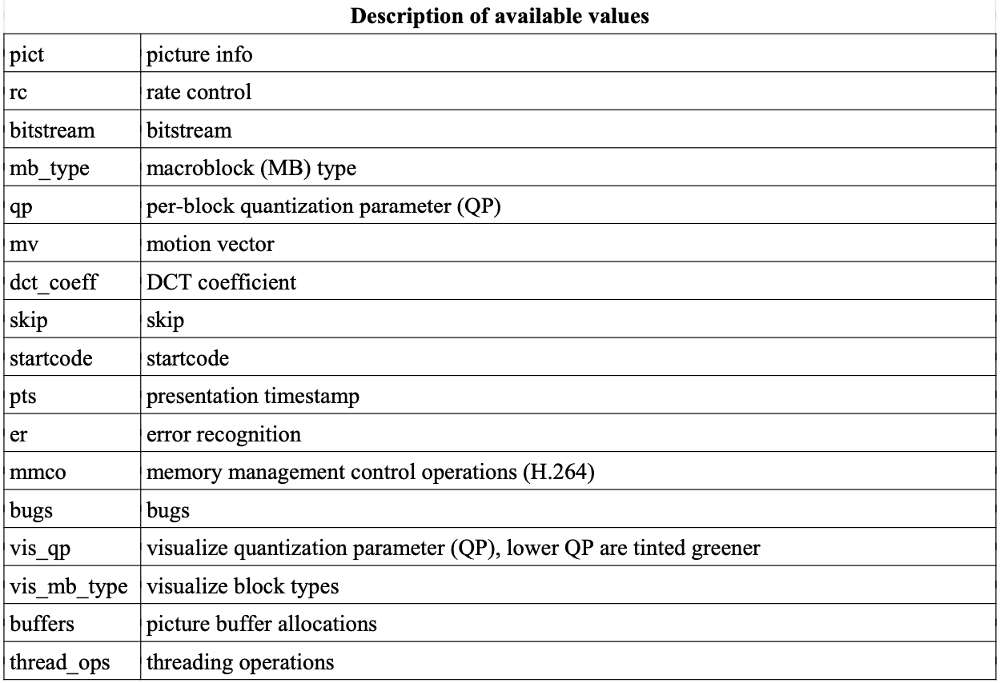
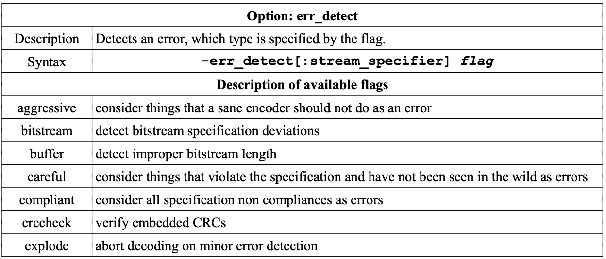
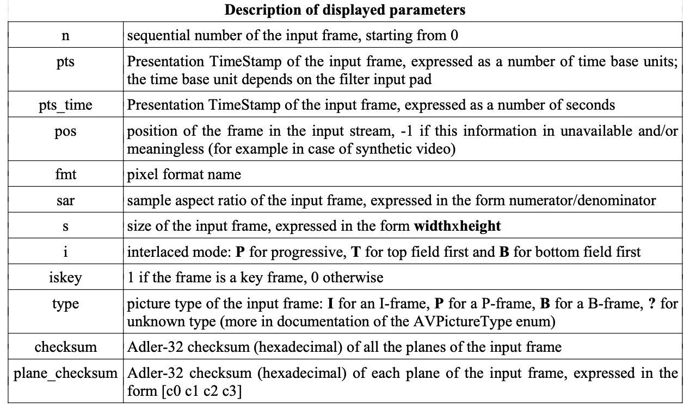

# ffmpeg提供应用程序

## ffmpeg

[Fmpeg 视频处理入门教程](https://www.ruanyifeng.com/blog/2020/01/ffmpeg.html)
[FFmpeg基本常识及编码流程](https://zhuanlan.zhihu.com/p/142593316)
[FFmpeg 实用命令](https://self-contained.github.io/FFmpeg/FFmpeg.html#)
[FFmpeg操作参数](https://zhuanlan.zhihu.com/p/145312133)
[FFmpeg 常用参数](https://gnonstop.linkpc.net/wp/?page_id=302)
[海强提供](https://gist.github.com/qvoid/59903f44a0013c283a87c0dd347ccfce)

```c
usage: ffmpeg [options] [[infile options] -i infile]... {[outfile options] outfile}...
```

### 查看信息

- 查看支持的编解码器（也就是-vcodec后面可以接的参数）
> ffmpeg -codecs
- 查看支持的像素格式（包括各种yuv等）：
> ffmpeg -pix_fmts
- 查看支持的封装格式（也就是-f后面可以接的参数）
> ffmpeg -formats
- 查看支持的滤镜（也就是-vf后面可以接的参数）:
> ffmpeg -filters

### 抽取码流

```
ffmpeg -i input_file -vcodec copy -an output_file_video　　//提取视频流，需要留意文件后缀，例如 .h264 不然可能抽取失败
ffmpeg -i input_file -acodec copy -vn output_file_audio　　//提取音频流
-an：disable audio
-vn：disable video

找到裸流格式
输入 ffmpeg -muxers,找到裸流格式。
输入 ffmpeg -i mpeg4.mp4 -c:v mpeg4 -f m4v video.mpeg4，即可提取.mpeg4的原始码流

码流后缀：
ivf (vp8/vp9/av1)
h264
h265
hevc
avs2
m4v(mpeg4)


ffmpeg -i 20130312_133313.mp4 -codec copy -bsf h264_mp4toannexb -f h264 20130312_133313.264
其中：
-i 20130312_133313.mp4 :是输入的MP4文件
-codec copy：从MP4封装中进行拷贝
-bsf: h264_mp4toannexb：从MP4拷贝到annexB封装
-f h264：采用h.264格式
20130312_133313.264：输出的文件名称
```


### 截取视频

```
ffmpeg  -i 源文件名 -vcodec copy -acodec copy -ss 00:00:10.000 -to 00:00:15.000 目标文件名 -y
其中：
-ss time_off    set the start time offset 设置从视频的哪个时间点开始截取，00:00:10是
                从视频的第10s开始截取
-to 截到视频的哪个时间点结束。00:00:15是到视频的第15s结束。如果用-t 表示截取多长的
    时间如 上文-to 换为-t则是截取从视频的第10s开始，截取15s时长的视频。即截出来的
    视频共15s.
    注意的地方是：如果将-ss放在“-i 源文件名”后面则-to的作用就没了，跟-t一样的效果了，
    变成了截取多长视频。一定要注意-ss的位置。

如果是yuv格式的数据，需要额外指定源数据的尺寸，如：
ffmpeg -video_size 720x480 -i yuvvideo.yuv -vcodec copy -acodec copy -ss 00:00:01.000 -to 00:00:03.300 -video_size 900x480 cut.yuv -y
ffplay -video_size 720x480 -i cut.yuv
其中：
-vcodec copy : -vcodec 后边可以跟指定的编码器，如果使用使用”copy“表示不做编解码，直接复制数据流
-acodec copy : 同上，只是这里表示的是音频
-i 表示源视频文件
-y 表示如果输出文件已存在则覆盖。
如：ffmpeg  -i D:/abc.avi -vcodec copy -acodec copy -ss 00:00:10 -to 00:00:15 D:/abc_clip.mp4 -y

从头截取yuv
ffmpeg -s 1920x1080 -i src.yuv -c:v rawvideo -filter:v select="gt(n\, -1)" -vframes 30 dst.yuv

从中间截取yuv
ffmpeg -s 1920x1080 -i src.yuv -c:v rawvideo -filter:v select="between(n\, 30\, 100)" dst.yuv

按时间截取yuv
ffmpeg -s 1920x1080 -r 1 -ss 10 -t 10 -i src.yuv -c:v copy dst.yuv


精确一些的方法，待整理验证
ffmpeg -ss [start] -t [duration] -accurate_seek -i [in].mp4 -codec copy [out].mp4

较为精确剪切视频(有转码)，待整理验证
ffmpeg -y -ss start -t duration -I filename -c:v libx264 -preset superfast -c:a copy
ffmpeg -y -ss start -t duration -accurate_seek -i filename codec copy -avoid_negative_ts 1
ffmpeg -ss [start] -t [duration] -i [in].mp4  -c:v libx264 -c:a aac -strict experimental -b:a 98k [out].mp4
```

### 格式转换

```
==> mp4转yuv
ffmpeg -i  input.mp4 -s 720x480 -pix_fmt  yuv420p  output420p_I420.yuv
ffmpeg -i  input.mp4 -s 720x480 -pix_fmt  nv12  output420sp_nv12.yuv
注意：
-s：设置输出yuv数据的分辨率
-pix_fmt：设置yuv数据的具体格式，可以通过 ffmpeg -pix_fmts 查看可以设置的格式，如果需要 420sp 的话可以选择 nv12 的fmt
mac OS 保存的 .mov 也可以作为输入使用

==> jpg转rgb数据
ffmpeg -i 0.origin.jpg -f rawvideo -vcodec rawvideo -pix_fmt bgr24  -s 1024x576 out_bgr24_1024x576.rgb
ffmpeg -i 0.origin.jpg -f rawvideo -vcodec rawvideo -pix_fmt bgra  -s 1024x576 out_bgra_1024x576.bgra
ffmpeg -i 0.origin.jpg -f rawvideo -vcodec rawvideo -pix_fmt rgba  -s 1024x576 out_rgba_1024x576.bgra
输出文件后缀名可以改成bgra、rgba等，可以使用yuview打开文件查看数据，注意数据通道要与数据匹配不然颜色会有问题

==> yuv 转 h264
if you have a raw YUV file, you need to tell ffmpeg which pixel format, which size, etc. is used:
ffmpeg -f rawvideo -pix_fmt yuv420p -s:v 1920x1080 -r 25 -i input.yuv -c:v libx264 output.mp4

If you just want the raw H.264 bitstream in a .264 file: 
ffmpeg -f rawvideo -pix_fmt yuv420p -s:v 1920x1080 -r 25 -i input.yuv -c:v libx264 -f rawvideo output.264

其中：
-vcodec  指定视频的编码格式，libxvid 是一般所说的 xvid
-codec:v 同上
-c:v 同上
-acodec 指定音频的编码格式, libmp3lame 就是常用的 mp3 格式
-codec:a 同上
-c:a 同上
另外还有其他简写：
-b:v  video bitrate
-b:a  audio bitrate
-r 25  帧率(fps)
-fs 7M  指定输出文件大小不能超过7M


==> ffmpeg 转码设定gop
ffmpeg  -i ./00024830.mpg -acodec copy -vcodec libx264 -keyint_min 30 -g 30 -sc_threshold 0 -crf 20 aa.mpg

==> 封装裸码流
ffmpeg -f m4v -i ./dec_in.bin.mpeg4 -vcodec copy dec_in.mp4


==> 转码
ffmpeg -threads 4 -i ./aa.ts -acodec copy -vcodec libx264 -preset placebo -crf 20 output.mp4

其中：
-threads
线程数量需要单独针对输入和输出指定
并非所有解码器都具有线程功能，有些解码器有几个。您可以查看解码器详细信息，例如ffmpeg -h decoder=h264

-crf
在优先保证画面质量（也不太在乎转码时间）的情况下，使用-crf参数来控制转码是比较
适宜的。这个参数的取值范围为0~51，其中0为无损模式，数值越大，画质越差，生成的文件
却越小。从主观上讲，18~28是一个合理的范围。18被认为是视觉无损的（从技术角度上看
当然还是有损的），它的输出视频质量和输入视频相当。

--preset 的参数主要调节编码速度和质量的平衡，有ultrafast、superfast、veryfast、
faster、fast、medium、slow、slower、veryslow、placebo这10个选项，从快到慢。

 --tune 的参数主要配合视频类型和视觉优化的参数，或特别的情况。如果视频的内容符合
其中一个可用的调整值又或者有其中需要，则可以使用此选项，否则建议不使用（如tune 
grain是为高比特率的编码而设计的）。
tune的值有：
film：        电影、真人类型
animation：   动画
grain：       需要保留大量的grain时用
stillimage：  静态图像编码时使用
psnr：        为提高psnr做了优化的参数
ssim：        为提高ssim做了优化的参数
fastdecode：  可以快速解码的参数
zerolatency： 零延迟，用在需要非常低的延迟的情况下，比如电视电话会议的编码
```

### 控制码率

[ffmpeg：码率控制模式、编码方式](https://blog.csdn.net/ETalien_/article/details/102931065)
[FFmpeg码率控制及内置编码参数介绍](https://blog.csdn.net/DONGHONGBAI/article/details/84776431)


#### 基本概念

- CQP：固定QP，最简单的码率控制方式，每帧图像都按照一个特定的QP来编码，每帧编码后的
数据量有多大是未知的，既不是码率优先模型也不是质量优先模型，不过是实现最简单的模型；

- CRF：（Constant Rate Factor）恒定码率系数。把某一个”视觉质量”作为输出目标。通过
降低那些耗费码率但是又难以用肉眼察觉的帧（高速运动或者纹理丰富）的质量提升那些
静态帧的码率来达到此目的。  
特点：帧间QP变化，帧内宏块的QP变化，输出码率未知，各帧输出的视觉质量基本恒定，
这种方式相当于固定质量模式+限制码率峰值的方式。

- CBR:（Constant Bit Rate）恒定码率，一定时间范围内比特率基本保持的恒定，属于码率
优先模型。

- VBR:（Variable Bit Rate）可变码率，简单场景分配比较大的QP，压缩率小，质量高。
复杂场景分配较小QP。得到基本稳定的视觉质量，因为人眼人眼本来就对复杂场景不敏感，
缺点在于输出码率大小不可控。

- ABR：(Average Bit Rate）恒定平均目标码率，简单场景分配较低bit,复杂场景分配足够bit，
使得有限的bit数能够在不同场景下合理分配，这类似VBR。同时一定时间内，平均码率又接近
设置的目标码率，这样可以控制输出文件的大小，这又类似CBR。可以认为是CBR和VBR的折中
方案，这是大多人的选择。特别在对质量和视频带宽都有要求的情况下，可以优先选择该模式，
一般速度是VBR的两倍到三倍，相同体积的视频文件质量却比CBR好很多。

#### 三种码率控制模式

##### -qp（constant quantizer恒定量化器模式）

所谓的量化器就是利用特殊算法将画质转化为数字，这样的话每一帧的画质都可以通过量化
参数来判定。在qp模式下，画质被分为0…20…40…51个级别，0就是无损的画质。用qp压制视频，
每一帧的画面都能达到该级别的质量，严格的遵循量化参数来编码，这么一来他的画质是最好
的，体积也是最大的，大到你无法想象，所以我们都不采用这种码率控制模式，除非你想无损
压制视频。

无损压缩的例子（快速编码）
> ffmpeg -i input.mkv -vcodec libx264 -preset ultrafast -qp 0 output.mkv

无损压缩的例子（高压缩比）
> ffmpeg -I input.mkv -vcodec libx264 -preset veryslow -qp 0 output.mkv

其中 -preset veryslow 设置编码器预设为veryslow


##### -b（bitrate固定目标码率模式）

编码器会试图让最终文件的整体码率与我们给定的码率相等，这么一来视频码率和文件体积
都是确定的，适用于对码率和体积有规定的情景。一般情况下现在大部分的视频软件都有这
方面的限制，如果你们有上传视频的需求，并且希望在有限的条件下达到较高的画质，那么
就可以采用这种码率控制模式。

但为什么要这么做呢？我们利用crf压制一个足够清晰，体积适中的视频文件，无论是用于
存储还是上传都可以，不同的视频网站有不同的参数限制，而且基本上他们都会二次压制后
转码，为了追求那么一点点画质，针对不同网站分别压制视频，实在是太浪费时间了，如果
那些网站的参数变动的话，我们怎么办，又要重新压制嘛。

所以基本上我们不采用这种码率控制模式。除非是压制极小的视频，或者是对视频文件大小
有严格限制的场景。


##### CRF（Constant Rate Factor - 限制码率因子）

crf其实是一个浮动的qp模式，他按照特定的标准，根据人体肉眼的特点，给予每帧画面不同
的量化参数，有些画面画质低一点，有些画面画质高一点其实人眼是很难识别的。所以我们
可以降低一点码率，然后把这些码率用到视觉敏感的画面里，这么一来，画质的变化几乎看
不出来，码率却降低了不少，文件体积自然也变小了

适用范围：
* 优点：该方法在输出文件的大小不太重要的时候，可以使整个文件达到特定的视频质量。
该编码模式在单遍编码模式下提供了最大的压缩效率，每一帧可以按照要求的视频质量去
获取它需要的比特数。
* 缺点：不好的一面是，你不能获取一个特定大小的视频文件，或者说将输出位率控制在
特定的大小上。

参数解析：
1. 量化比例的范围为0～51，其中0为无损模式，23为缺省值，51可能是最差的。该数字越小，
图像质量越好。从主观上讲，18~28是一个合理的范围。18往往被认为从视觉上看是无损的，
它的输出视频质量和输入视频一模一样或者说相差无几。但从技术的角度来讲，它依然是
有损压缩。
2. 若Crf值加6，输出码率大概减少一半；若Crf值减6，输出码率翻倍。通常是在保证可接受
视频质量的前提下选择一个最大的Crf值，如果输出视频质量很好，那就尝试一个更大的值，
如果看起来很糟，那就尝试一个小一点值。

使用方法 - 命令行：
```c
ffmpeg -i <input> -c:v libx264 -crf 23 <output>
ffmpeg -i <input> -c:v libx265 -crf 28 <output>
ffmpeg -i <input> -c:v libvpx-vp9 -crf 30 -b:v 0 <output>
```

以上三种码率控制均是单遍编码，所以在采用qp或者crf的时候，最好搭配编码器预设veryslow，
这样一来参数控制更精准一些。

##### Two-Pass ABR（两遍模式）

适用范围：如果你的目标是一个确定大小的文件而且帧与帧之间的视频质量并不重要，这个
方法很适用。这通过一个例子可以得到很好地解释。比如预期视频文件有10min(600s)，
200 MB： 200 * 8192 / 600 = ~2730 Kb 2730 - 128(音频常用的比特率) = 2602 kb

使用方法 \- 命令行
```c
ffmpeg -y -i input -c:v libx264 -b:v 2600k -pass 1 -c:a aac -b:a 128k -f mp4 /dev/null && \
ffmpeg -i input -c:v libx264 -b:v 2600k -pass 2 -c:a aac -b:a 128k output.mp4
//如果是 Windows 环境， /dev/null 换为 NUL，\ 换为 ^
```

#### 其他码率控制方式

* ABR（Average Bitrate - 平均码率）

解析：
它提供了某种“运行均值”的目标，终极目标是最终文件大小匹配这个“全局平均”数字（因此
基本上来说，如果编码器遇到大量码率开销非常小的黑帧，它将以低于要求的比特率编码，
但是在接下来几秒内的非黑帧它将以高质量方式编码方式使码率回归均值）使用两遍编码
模式时这个方法变得更加有效，你可以和“max bit rate ”配合使用来防止码率的波动。
现在的网络视频基本上都是采用ABR平均比特率的编码方式，如果VBR的码率变化太大，用户
的设备或网络状况又不好的情况下很容易变成花屏或者黑屏。

使用方法
```c
ffmpeg -i <input> -c:v libx264 -b:v 1M <output>
ffmpeg -i <input> -c:v libx265 -b:v 1M <output>
ffmpeg -i <input> -c:v libvpx-vp9 -b:v 1M <output>
```

* CBR（Constant BitRate - 恒定码率）

解析：
事实上根本就没有CBR这种模式，但是你可以通过补充ABR参数“模拟”一个恒定比特率设置。

使用方法 - 命令行
```c
ffmpeg -i <input> -c:v libx264 -x264-params "nal-hrd=cbr:force-cfr=1" -b:v 1M -minrate 1M -maxrate 1M -bufsize 2M <output>
// VP9
ffmpeg -i <input> -c:v libvpx-vp9 -b:v 1M -maxrate 1M -minrate 1M <output>
```

* VBR（variable bit rate）

bitrate固定目标码率模式默认采用的是VBR动态（可变）比特率的方式进行编码，简单的
内容少给点码率，复杂的内容多给点码率。

VBR例子：ffmpeg -i input.mp4 -vcodec libx264 -preset veryslow output.mp4


* CQP（Constant Quantization Parameter - 固定质量参数）

解析：
值越大，压缩率越大，质量越低。

使用方法 - 命令行
```c
ffmpeg -i <input> -c:v libx264 -qp 23 <output>
ffmpeg -i <input> -c:v libx265 -x265-params qp=23 <output>
```

* 最大比特率的CRF/2-pass模式

你可以通过声明-maxrate确保最大码率限制在一个范围里，对于流式传输非常有用，可以配合到（2-Pass）ABR或CRF模式一起使用。

使用方法 - 命令行
```c
// crf
ffmpeg -i <input> -c:v libx264 -crf 23 -maxrate 1M -bufsize 2M <output>
ffmpeg -i <input> -c:v libx265 -crf 28 -x265-params vbv-maxrate=1000:vbv-bufsize=2000 <output>
ffmpeg -i <input> -c:v libvpx-vp9 -crf 30 -b:v 2M <output>
// 2-pass abr & vbv
ffmpeg -i <input> -c:v libx264 -b:v 1M -maxrate 1M -bufsize 2M -pass 1 -f mp4 /dev/null
ffmpeg -i <input> -c:v libx264 -b:v 1M -maxrate 1M -bufsize 2M -pass 2 <output>

ffmpeg -i <input> -c:v libx265 -b:v 1M -x265-params pass=1:vbv-maxrate=1000:vbv-bufsize=2000 -f mp4 /dev/null
ffmpeg -i <input> -c:v libx265 -b:v 1M -x265-params pass=2:vbv-maxrate=1000:vbv-bufsize=2000 <output>

ffmpeg -i <input> -c:v libvpx-vp9 -b:v 1M -maxrate 1M -bufsize 2M -pass 1 -f webm /dev/null
ffmpeg -i <input> -c:v libvpx-vp9 -b:v 1M -maxrate 1M -bufsize 2M -pass 2 <output>
```

编写代码的话，指定 AVCodecContext 的 rc_max_rate 和 rc_buffer_size 即可。bufsize
根据你希望比特率获得多大的可变性而设置，默认为 maxrate 的两倍，如果想限制流的比特
率，可以设置为 maxrate 的一半。

配合 CRF 模式使用的时候，如果设置的 crf 值过低，视频码率可能超出 -maxrate 的时候，
编码器会自动调整 crf，避免出现较大的码率波动。然而，x264 不会严格控制你指定的最大
码率，除非使用 2 pass 模式。


#### 建议命令
使用 ABR 模式，即平均码率的方法

- 生成视频 (总帧数 = duration x rate)
> ffmpeg -re -f lavfi -i testsrc=duration=30:size=1280x800:rate=25 -vcodec libx264 -r:v 25 -g 25 output_test.mp4 -y


- 重新编码控制码率
> ffmpeg -i output_test.mp4 -c:v libx264 -b:v 2M output.mp4 -y

其中：-bufsize 会影响码控，不使用会比较好


### map 参数的使用

`ffmpeg` 中的 `-map` 参数用于精确控制输入文件流如何映射到输出文件。它允许用户选择
特定的流（音频、视频、字幕等）进行处理和输出。以下是对 `-map` 参数的详细介绍：

#### 基本语法
```bash
ffmpeg -i input1 -i input2 -map [input_file_index]:[stream_type]:[stream_index] output
```
- `input_file_index`：输入文件的索引，从 0 开始。
- `stream_type`：流的类型，可以是 `v`（视频）、`a`（音频）、`s`（字幕）等。
- `stream_index`：流的索引，从 0 开始。

#### 示例

1. **选择第一个输入文件的第一个视频流和音频流**
   ```bash
   ffmpeg -i input1.mp4 -map 0:v:0 -map 0:a:0 output.mp4
   ```
   这里，`0:v:0` 代表第一个输入文件的第一个视频流，`0:a:0` 代表第一个输入文件的第一个音频流。

2. **从多个输入文件中选择不同的流**
   ```bash
   ffmpeg -i video.mp4 -i audio.mp3 -map 0:v:0 -map 1:a:0 output.mkv
   ```
   这里，视频来自 `video.mp4`（第一个输入文件），音频来自 `audio.mp3`（第二个输入文件）。

3. **选择所有流**
   ```bash
   ffmpeg -i input.mkv -map 0 output.mkv
   ```
   这里，`-map 0` 代表选择第一个输入文件的所有流。

4. **选择特定类型的所有流**
   ```bash
   ffmpeg -i input.mkv -map 0:v -map 0:a output.mkv
   ```
   这里，`0:v` 代表第一个输入文件的所有视频流，`0:a` 代表第一个输入文件的所有音频流。

#### 高级用法

1. **使用负值选择**
   ```bash
   ffmpeg -i input.mp4 -map 0 -map -0:s output.mp4
   ```
   这里，`-map -0:s` 表示排除第一个输入文件的所有字幕流。

2. **复制流**
   ```bash
   ffmpeg -i input.mp4 -map 0 -c copy output.mp4
   ```
   这里，`-c copy` 表示复制所有选择的流而不进行重新编码。

3. **重映射流**
   ```bash
   ffmpeg -i input.mp4 -map 0:v:0 -map 0:a:0 -map 0:a:1 -map 0:s:0 output.mkv
   ```
   这里，输出文件中包含第一个视频流、第一个和第二个音频流以及第一个字幕流。

4. **使用标签**
   ```bash
   ffmpeg -i input.mkv -map 0:0 -map 0:1 -map 0:2 -map_metadata 0 -map_chapters 0 output.mkv
   ```
   这里，`-map_metadata 0` 复制输入文件的元数据，`-map_chapters 0` 复制章节信息。


### 下载 m3u8

 ffmpeg -i http://9343.long-vod.cdn.aodianyun.com/u/9343/m3u8/1280x720/720-f70034484d9d71b66f32b6cbb5534126/720-f70034484d9d71b66f32b6cbb5534126.m3u8 -acodec copy -bsf:a aac_adtstoasc -vcodec copy 1.mp4
 
### check audio info

> ffmpeg -report -i audio.wav -af ashowinfo -f null /dev/null

### 检查坏帧

> ffmpeg -i \<input\> -vf showinfo [-vframes num] -f null -

### 显示帧的debug信息

> ffplay -debug pict -vf showinfo -i ./test.h264

### 获取视频播放时长

- 容器时长（container duration）：
> ffprobe -v error -show_entries format=duration -of default=noprint_wrappers=1:nokey=1 -i input.mp4
- 音视频流时长（stream duration）：
> ffprobe -v error -select_streams v:0 -show_entries stream=duration -of default=noprint_wrappers=1:nokey=1 input.mp4
- 前边两种方法未必能获取到时长，但是可以通过完全解码的方法获取时长：
> ffmpeg -i input -f null -

### 将输出重定向

```
ffmpeg xxxxx > /dev/null 2>&1
ffmpeg xxxxx > <out_file> 2>&1

ffmpeg ffprobe等的命令行执行结果是错误输出(2) 而不是屏幕输出(1)，所以需要重定向后才可以输出到文件


There are two formats for redirecting standard output and standard error:
       &>word
and
       >&word
Of the two forms, the first is preferred.  This is semantically equivalent to
       >word 2>&1
```


#### 生成测试图案
* testsrc
```
ffmpeg -f lavfi -i testsrc=duration=10:size=1280x720:rate=30 testsrc.mpg
ffmpeg -re -f lavfi -i testsrc=duration=2:size=720x480:rate=25:decimals=4 -vcodec libx264 -r:v 25 -g 25 output.mp4 -y
```
其中：
* 总帧数 = duration x rate
* decimals: 设置时间戳中显示的小数位数，仅在 at code{testsrc} 源中使用。
            显示的时间戳值将对应于原始时间戳值乘以指定值的 10 次方。 默认值为 0。
            个人理解：一秒的时间为小数点后100(0-99)，如果帧率为25，则每帧增加0.040，
            25帧可以增加到100，进位
* -g: 设置gop，可以生成 I 帧，可设可不设

如果想每帧图像进位为1，则需要将帧率设为100，即每秒100帧：
```
ffmpeg -re -f lavfi -i testsrc=duration=1:size=720x480:rate=100:decimals=4 -vcodec libx264 -r:v 100 -g 25 output.mp4 -y
```
遇到 sps chroma_format_idc=3 的问题，需要ffmpeg重新转码：
```
ffmpeg -i  output.mp4 -s 720x480 -pix_fmt  yuv420p  output420p_I420.yuv
ffmpeg -f rawvideo -pix_fmt yuv420p -s:v 720x480 -r 25 -i output420p_I420.yuv -c:v libx264 output.h264
```

smptebars
```
ffmpeg -f lavfi -i smptebars=duration=10:size=640x360:rate=30 smptebars.mp4
```

color source
```
ffmpeg -f lavfi -i color=c=red@0.2:duration=5:s=qcif:r=10 colorsrc.mp4
```

rgbtestsrc
```
ffmpeg -f lavfi -i rgbtestsrc -pix_fmt yuv420p -t 5 rgbtestsrc.mp4
```

生成随机雪花视频
```
ffmpeg -y -re -f lavfi -i "nullsrc=s=256x256,geq=random(1)*255:128:128" -vcodec libx264 -r:v 25 output.mp4
```

参考：
[FFmpeg Filters Documentation](http://ffmpeg.org/ffmpeg-filters.html#color_002c-haldclutsrc_002c-nullsrc_002c-rgbtestsrc_002c-smptebars_002c-smptehdbars_002c-testsrc)

### 滤镜

#### 简单滤镜

简单滤镜就是只有1个输入和输出的滤镜，滤镜两边的数据都是同一类型的，可以理解为在
非压缩数据帧到再次编码前简单附加了一步

#### 复杂滤镜

复杂滤镜，通常是具有多个输入输出文件，并有多条执行路径；ffmpeg 命令行中使用 -lavfi、
-filter_complex 表示复合滤镜

##### drawtext 滤镜

本质是：使用libfreetype库从视频顶部的指定文件中绘制文本字符串或文本。
使用前提：要启用此过滤器的要么在编译 ffmpeg 的时候使用 --enable-libfreetype 配置FFmpeg
如果要启用默认字体回退和字体选项，那需要使用 --enable-libfontconfig 配置FFmpeg
如果要启用 text_shaping 选项，需要使用 --enable-libfribidi 配置FFmpeg

参数
```
box        用背景色在文本周围画一个方框。取值为1(启用)或0(禁用)。box的默认值为0。
boxborderw 使用框色设置框周围边框的宽度。boxborderw的默认值是0。
boxcolor   用于在文本周围绘制框的颜色。boxcolor默认值为“white”。
line_spacing 使用“方框”设置要在方框周围绘制的边框的像素线间距。line_spacing的默认值是0。
borderw    使用边框颜色设置要围绕文本绘制的边框的宽度。borderw的默认值为0。
bordercolor  设置用于在文本周围绘制边框的颜色。bordercolor的默认值为“black”。
expansion  选择文本的展开方式。可以是none、strftime(已弃用)或normal(默认)。详细信息请参阅下面的文本扩展部分。
basetime  设置计数的开始时间。取值单位为微秒。仅适用于已弃用的strftime扩展模式。
          要在普通扩展模式下进行模拟，使用pts函数，提供开始时间(以秒为单位)作为
          第二个参数。
fix_bounds 如果为真，检查并修复文本协调以避免剪切。
fontcolor 用于绘制字体的颜色。fontcolor 的默认值为“black”。
fontcolor_expr 字符串，以与文本相同的方式展开，以获得动态fontcolor值。默认情况下，
               该选项的值为空，不进行处理。当设置此选项时，它将覆盖fontcolor选项。
font     用于绘制文本的字体系列。在默认情况下没有。如STSONG.TTF字体类型，可以从
         C:\Windows\Fonts 拷贝一个有效的字体文件
fontfile 用于绘制文本的字体文件。必须包括路径。当fontconfig支持被禁用时，此参数
         为必选参数。
alpha    绘制文本应用alpha混合。这个值可以是一个介于0.0和1.0之间的数字。表达式也
         接受相同的变量x, y。默认值为1。请参阅fontcolor_expr。
fontsize 用于绘制文本的字体大小。fontsize 默认值为16。
text_shaping 如果设置为1，则在绘制文本之前尝试对其进行整形(例如，颠倒文本从右到左
             的顺序并连接阿拉伯字符)。否则，就完全按照给定的方式绘制文本。默认为
             1(如果支持)。
ft_load_flags 用于加载字体的标志。flags 映射了 libfreetype 支持的相应标志，并且
              是以下值的组合（默认值为“Default”）：
                default
                no_scale
                no_hinting
                render
                no_bitmap
                vertical_layout
                force_autohint
                crop_bitmap
                pedantic
                ignore_global_advance_width
                no_recurse
                ignore_transform
                monochrome
                linear_design
                no_autohint
shadowcolor  用于在绘制的文本后面绘制阴影的颜色。对于此选项的语法，请检查(ffmpeg-utils)
             ffmpeg-utils手册中的“颜色”部分。shadowcolor的默认值是“black”。
shadowx、shadowy 文本阴影位置相对于文本位置的x和y偏移量。它们可以是正的，也可以是
                 负的。两者的默认值都是“0”。
start_number   n/frame_num变量的起始帧号。默认值为“0”。
tabsize      用于呈现选项卡的空格数的大小。默认值为4。
timecode     设置初始时间码表示格式为“hh:mm:ss[:;”。ff”格式。它可以带或不带文本
             参数使用。timeecode_rate选项必须指定。
timecode_rate, rate, r  设置时间码帧速率(仅限时间码)。值将四舍五入为最接近的整数。
                        最小值为1。支持帧速率为30和60的拖帧时间码。
tc24hmax   如果设置为1，时间码选项的输出将环绕24小时。默认为0(禁用)。
text       要绘制的文本字符串。文本必须是UTF-8编码字符序列。如果没有指定textfile
           参数，则此参数为必选项。
textfile   包含要绘制的文本的文本文件。文本必须是UTF-8编码字符序列。如果没有指定
           文本字符串，则此参数为必选参数。如果同时指定了text和textfile，则抛出错误。
text_source 如果要在侧数据的检测框中使用文本数据，则文本源应该设置为
            side_data_detection_bboxes。
            如果设置了text source, text和textfile将被忽略，在侧数据的检测框中仍然
            使用文本数据。因此，如果您不确定文本源，请不要使用此参数。
reload   如果设置为1，文本文件将在每一帧之前重新加载。一定要原子地更新它，否则它
         可能被部分读取，甚至失败。
x、y  指定在视频帧内绘制文本的偏移量的表达式。它们相对于输出图像的上/左边界。x和
      y的默认值为“0”。
```

举例：

添加本地时间水印
> ffmpeg -t 5 -i input.h264 -vf "drawtext=fontsize=60:text='%{localtime\:%T}'" -c:v libx264 -an output.h264 -y

按指定格式添加本地时间水印
> ffmpeg -t 5 -i input.h264 -vf "drawtext=fontsize=60:text='%{localtime\:%Y-%M-%d %H.%m.%S}'" -c:v libx264 -an output.h264 -y

添加本地时间水印,打印详细日期并且精确到毫秒
> ffmpeg -t 5 -i input.h264 -vf "settb=AVTB,setpts='trunc(PTS/1K)*1K+st(1,trunc(RTCTIME/1K))-1K*trunc(ld(1)/1K)',drawtext=fontsize=30:fontcolor=red:text='%{localtime}.%{eif\:1M*t-1K*trunc(t*1K)\:d}'" -c:v libx264 -an -f mp4 output.h264 -y

把视频的pts时间戳添加为视频水印，精度到毫秒
> ffmpeg -t 5 -i input.h264 -vf "drawtext=fontsize=60:text='%{pts\:hms}'" -c:v libx264 -an -f mp4 output.h264 -y


### Debug and Test

#### 打印等级

To set the logging level we can use option -v or -loglevel option

定义可以在 log.h 中找到，数值越大打印的信息越多

| "quiet"   | -8 |
|-----------|----|
| "panic"   | 0  |
| "fatal"   | 8  |
| "error"   | 16 |
| "warning" | 24 |
| "info"    | 32 |
| "verbose" | 40 |
| "debug"   | 48 |
| "trace"   | 56 |

demo:
> ffmpeg -v 48 -i input output

#### -debug[:stream_specifier]

Prints specific debugging information about selected audio, subtitle or video stream(s).


demo:
> ffmpeg -debug startcode -i input output

##### poc

> ffmpeg -debug rc -i \<input\> -f null - 2>&1 | grep POC

> ffmpeg -debug mmco -i input.h264 -f null - 2>&1 | grep POC

> ffmpeg -v 48 -i input output

#### -debug_ts

prints a timestamp information during processing

demo:
> ffmpeg -debug_ts -i input output

#### -fdebug

Option -fdebug has only 1 possible value ts and is often used together with
-debug_ts option for various tests, for instance to debug DTS (decoding timestamp)
and PTS (presentation timestamp) relations.

demo:
> ffmpeg -fdebug ts -i input output

#### -err_detec



demo:
> ffmpeg -err_detect buffer -i input output

#### -vf showinfo

可以用于检查坏帧

To display information for each video frame we can use a showinfo filter described in the table:




## ffprobe

### 关于如何查看视频的 GOP、帧类型

> ffprobe -v quiet -show_frames -i \<input\> |   grep   "pict_type="

### 获取视频帧数量

> ffprobe -v error -select_streams v:0 -count_packets -show_entries stream=nb_read_packets -of csv=p=0 input.mp4

## ffplay

### ffplay 使用示例
- 播放 test.mp4 ，播放完成后自动退出
> ffplay -autoexit test.mp4
- 以 320 x 240 的大小播放 test.mp4
> ffplay -x 320 -y 240 test.mp4
- 将窗口标题设置为 "myplayer"，循环播放 2 次
> ffplay -window_title myplayer -loop 2 test.mp4
- 播放 双通道 32K 的 PCM 音频数据
> ffplay -f s16le -ar 32000 -ac 2 test.pcm
- 播放yuv
```
ffplay -video_size 864x486 -i guomei.yuv
ffplay -video_size 864x486 -pix_fmt yuv420p guomei.yuv
ffplay -f rawvideo -video_size 426x240 -pix_fmt yuv422p ./firestone.yuv
```
- 播放rgb
> ffplay -s 1024x576 -pix_fmt bgr565le -i ./output37.rgb

### 播放指定stream

在 ffplay 中，当视频文件中包含多个视频/音频码流时，可以使用 -vst/-ast/sst 参数来
分别选择要播放的视频流/音频流/字幕流。这允许你指定要播放的流的索引，从而实现对
特定流的选择和播放。

基本语法
```bash
ffplay -vst [video_stream_index] -ast [audio_stream_index] input_file
```
* video_stream_index：要播放的视频流的索引，从 0 开始。
* audio_stream_index：要播放的音频流的索引，从 0 开始。
* input_file：输入视频文件。

### ffplay 可使用的选项

#### 一些通用选项
```
'-L'      显示 license
'-h, -?, -help, --help [arg]' 打印帮助信息；可以指定一个参数 arg ，如果不指定，只打印基本选项

可选的 arg 选项：
'long'    除基本选项外，还将打印高级选项
'full'    打印一个完整的选项列表，包含 encoders, decoders, demuxers, muxers, filters 等的共享以及私有选项
'decoder=decoder_name'    打印名称为 "decoder_name" 的解码器的详细信息
'encoder=encoder_name'    打印名称为 "encoder_name" 的编码器的详细信息
'demuxer=demuxer_name'    打印名称为 "demuxer_name" 的 demuxer 的详细信息
'muxer=muxer_name'        打印名称为 "muxer_name" 的 muxer 的详细信息
'filter=filter_name'      打印名称为 "filter_name" 的过滤器的详细信息
'-version'     显示版本信息
'-formats'     显示有效的格式
'-codecs'      显示 libavcodec 已知的所有编解码器
'-decoders'    显示有效的解码器
'-encoders'    显示有效的编码器
'-bsfs'        显示有效的比特流过滤器
'-protocols'   显示有效的协议
'-filters'     显示 libavfilter 有效的过滤器
'-pix_fmts'    显示有效的像素格式
'-sample_fmts' 显示有效的采样格式
'-layouts'     显示通道名称以及标准通道布局
'-colors'      显示认可的颜色名称
'-hide_banner' 禁止打印欢迎语；也就是禁止默认会显示的版权信息、编译选项以及库版本信息等
```

#### 一些主要选项
```
'-x width'        强制以 "width" 宽度显示
'-y height'       强制以 "height" 高度显示
'-an'             禁止音频
'-vn'             禁止视频
'-ss pos'         跳转到指定的位置(秒)
'-t duration'     播放 "duration" 秒音/视频
'-bytes'          按字节跳转
'-nodisp'         禁止图像显示(只输出音频)
'-f fmt'          强制使用 "fmt" 格式
'-window_title title'  设置窗口标题(默认为输入文件名)
'-loop number'    循环播放 "number" 次(0将一直循环)
'-showmode mode'  设置显示模式

可选的 mode ：
'0, video'    显示视频
'1, waves'    显示音频波形
'2, rdft'     显示音频频带
默认值为 'video'，你可以在播放进行时，按 "w" 键在这几种模式间切换
'-i input_file'   指定输入文件
```

#### 一些高级选项

```
'-sync type'          设置主时钟为音频、视频、或者外部。默认为音频。主时钟用来进行音视频同步
'-threads count'      设置线程个数
'-autoexit'           播放完成后自动退出
'-exitonkeydown'      任意键按下时退出
'-exitonmousedown'    任意鼠标按键按下时退出
'-acodec codec_name'  强制指定音频解码器为 "codec_name"
'-vcodec codec_name'  强制指定视频解码器为 "codec_name"
'-scodec codec_name'  强制指定字幕解码器为 "codec_name"
```

#### 一些快捷键

```
'q, ESC'            退出
'f'                 全屏
'p, SPC'            暂停
'w'                 切换显示模式(视频/音频波形/音频频带)
's'                 步进到下一帧
'left/right'        快退/快进 10 秒
'down/up'           快退/快进 1 分钟
'page down/page up' 跳转到前一章/下一章(如果没有章节，快退/快进 10 分钟)
'mouse click'       跳转到鼠标点击的位置(根据鼠标在显示窗口点击的位置计算百分比)
```
